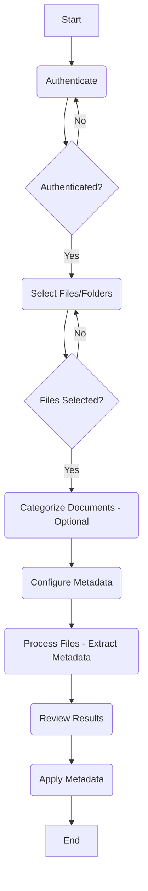

# Solution Design Document: Box Metadata AI Application

## 1. Introduction/Overview

### 1.1. Purpose of the Document

This Solution Design Document (SDD) provides a comprehensive technical blueprint for the Box Metadata AI Application. Its purpose is to detail the application's architecture, components, data flows, and functionalities, serving as a central reference for development, testing, and future enhancements. This document outlines how the application leverages the Box Platform APIs, particularly the Box AI API, to automate the extraction and application of metadata to files stored within Box, addressing specific business needs for improved content organization and retrieval.

### 1.2. Project Objectives

The primary objectives of the Box Metadata AI Application are:

*   **Automate Metadata Extraction:** Utilize Box AI capabilities (specifically the Extract Structured API) to automatically extract relevant metadata from documents stored in Box.
*   **Support Multiple Extraction Methods:** Provide flexibility through both freeform (prompt-based) and structured (template-based or custom field-based) metadata extraction.
*   **Incorporate Confidence Scoring:** Capture and display AI-generated confidence scores (High, Medium, Low) for extracted metadata to aid user review and validation.
*   **Enable Document Categorization:** Allow users to categorize documents using AI to facilitate targeted metadata configuration and application.
*   **Facilitate Metadata Configuration:** Offer a user-friendly interface for configuring extraction parameters, including prompts, template selection, document type mappings, and AI model choice.
*   **Streamline Metadata Application:** Enable users to review extracted metadata and apply it efficiently to selected files or batches of files, either as freeform properties or against specific Box metadata templates.
*   **Handle Batch Processing:** Support processing and applying metadata to multiple files efficiently.
*   **Provide User Guidance:** Offer an intuitive user interface (built with Streamlit) with clear navigation and guidance through the workflow.

### 1.3. Intended Audience

This document is intended for various stakeholders involved in the application's lifecycle, including:

*   **Developers:** To understand the technical design, architecture, component interactions, and implementation details for maintenance and future development.
*   **Testers:** To formulate test plans and cases based on the specified functionality and requirements.
*   **System Administrators/Operations:** To understand deployment, configuration, and operational aspects.
*   **Business Analysts:** To verify that the technical solution aligns with business requirements.
*   **Project Managers:** To understand the scope, components, and technical approach.

### 1.4. Document Structure

This document is organized into the following sections:

1.  **Introduction/Overview:** Provides context, objectives, audience, and structure.
2.  **Existing Functionality Summary:** Briefly describes the application's state before recent enhancements and fixes.
3.  **Requirement Details:** Outlines the key business and technical requirements addressed.
4.  **Assumptions and Prerequisites:** Lists assumptions made and prerequisites needed.
5.  **High-Level Design:** Presents the overall system architecture and process flow.
6.  **Low-Level Design / Component Design:** Details the individual modules and their functions.
7.  **Interface & Integration:** Describes interactions with external systems (Box API, Streamlit).
8.  **Data Flow:** Illustrates how data moves through the application.
9.  **User Interface Design:** Provides an overview of the UI and user workflow.
10. **Security Requirements:** Covers authentication and credential handling.
11. **Error Handling and Validation:** Details how errors and invalid data are managed.
12. **Testing and Deployment:** Discusses the testing approach and deployment considerations.
13. **Impact Analysis:** Assesses the solution's impact.
14. **Out-of-Scope Items:** Clarifies what is not included.
15. **Risks and Mitigation:** Identifies potential risks.
16. **Appendices:** Includes supplementary information.
17. **Revisions and Acceptance:** Tracks document changes and approvals.

## 2. Existing Functionality Summary

### 2.1. Core Capabilities (Pre-Enhancements/Fixes)

Prior to the recent enhancements focused on confidence scoring and subsequent bug fixes, the Box Metadata AI Application provided a foundational workflow for leveraging Box AI. The core capabilities included:

*   **Authentication:** Users could authenticate with their Box accounts using OAuth 2.0.
*   **File Selection:** A file browser allowed users to navigate their Box content and select individual files for processing.
*   **Basic Metadata Configuration:** Users could choose between freeform or structured extraction. For freeform, a single prompt could be defined. For structured, a single Box metadata template could be selected from the available templates in the user's enterprise.
*   **Metadata Extraction:** The application utilized the Box AI API (likely an earlier version or different endpoint/prompt structure) to extract metadata based on the configuration.
*   **Results Viewing:** Extracted metadata was displayed for user review.
*   **Metadata Application:** Users could apply the extracted metadata to the selected files, either as freeform properties or against the chosen structured template.

### 2.2. Context for Current Design

The initial version provided a proof-of-concept for AI-driven metadata extraction within Box. However, it lacked features like confidence scoring, batch processing robustness, document-type specific configurations, and sophisticated error handling. The recent enhancements aimed to introduce confidence scoring, but this inadvertently broke the metadata application functionality, particularly for structured templates. The subsequent debugging and fixing process (detailed in the `fix_documentation.md`) led to significant refinements in error handling, template selection logic, data type validation, and UI navigation, resulting in the current, more robust application design detailed in this document.

## 5. High-Level Design

### 5.1. System Architecture Overview

The Box Metadata AI Application is a web-based tool built using the Streamlit framework in Python. It functions as a client application that interacts directly with the Box Platform APIs.

*   **Frontend:** Streamlit provides the user interface (UI), rendering components, handling user interactions (button clicks, selections), and managing application flow through session state.
*   **Backend Logic:** Python scripts contain the core application logic, including:
    *   Interfacing with the Box SDK and APIs for authentication, file operations, metadata template retrieval, metadata instance management, and AI calls.
    *   Implementing the workflow steps (file browsing, configuration, extraction, application).
    *   Processing data (parsing AI responses, formatting metadata).
    *   Managing application state.
*   **External Dependencies:** The application relies heavily on the Box Platform:
    *   **Box Content Cloud:** For storing and managing files.
    *   **Box Authentication Service:** For user authentication (OAuth 2.0).
    *   **Box APIs:** For all interactions with Box content and services.
    *   **Box AI API:** Specifically the Extract Structured endpoint for metadata extraction.

The application follows a modular design, with distinct functionalities encapsulated in separate Python modules within the `modules` directory, orchestrated by the main `app.py` script.

### 5.2. Process Flow (User Journey)

The application guides the user through a sequential workflow:

1.  **Authentication:** User logs into their Box account via OAuth 2.0.
2.  **File Selection:** User browses their Box folders and selects individual files or entire folders for processing.
3.  **Document Categorization (Optional):** User can optionally run AI-based categorization on selected files to determine document types.
4.  **Metadata Configuration:** User configures how metadata should be extracted:
    *   Selects extraction method (Freeform or Structured).
    *   Provides prompts (for Freeform) or selects Box metadata templates/defines custom fields (for Structured).
    *   Maps templates/prompts to specific document types (if categorized).
    *   Selects the AI model.
    *   Configures batch processing settings.
5.  **Process Files (Extraction):** The application calls the Box AI API in batches to extract metadata from the selected files based on the configuration.
6.  **Review Results:** User reviews the extracted metadata, including AI confidence scores, and can make edits or select specific results for application.
7.  **Apply Metadata:** User initiates the application of the reviewed/selected metadata to the corresponding files in Box, either as freeform properties or against the designated structured templates.

### 5.3. Key Technologies

*   **Programming Language:** Python 3.10+
*   **Web Framework:** Streamlit
*   **Box Interaction:** Box Python SDK (`boxsdk`)
*   **API Communication:** `requests` library (for direct Box AI API calls)
*   **Data Handling:** Standard Python libraries (`json`, `datetime`, etc.)

## 8. Data Flow

This section describes the movement of data through the application during key processes.

### 8.1. Authentication Flow

1.  **User Action:** User initiates login.
2.  **Application (`authentication.py`):** Redirects user to Box OAuth 2.0 authorization page.
3.  **User Action:** User logs into Box and grants application access.
4.  **Box Platform:** Redirects user back to the application with an authorization code.
5.  **Application (`authentication.py`):** Exchanges the authorization code for an access token and refresh token using the Box SDK.
6.  **Application:** Initializes the Box SDK client object with the obtained tokens.
7.  **Session State:** Stores the authenticated client object and sets the `authenticated` flag to `True`.

### 8.2. File Selection Flow

1.  **User Action:** Navigates to the "File Browser" page.
2.  **Application (`file_browser.py`):** Uses the authenticated Box client to list folders and files starting from the user's root folder (or a specified starting point).
3.  **User Action:** Navigates folders and selects checkboxes next to desired files or folders.
4.  **Application (`file_browser.py`):** If folders are selected, recursively fetches file details (ID, name) within those folders using the Box API.
5.  **Session State:** Stores the list of selected file objects (containing ID and name) in `st.session_state.selected_files`.

### 8.3. Configuration Data Flow

1.  **User Action:** Navigates to the "Metadata Configuration" page.
2.  **Application (`metadata_config.py`):** Reads current configuration settings from `st.session_state.metadata_config` and `st.session_state.document_type_to_template`.
3.  **Application:** Fetches available metadata templates from `st.session_state.metadata_templates` (retrieved via `metadata_template_retrieval.py`).
4.  **Application:** Displays UI elements (radio buttons, text areas, select boxes, sliders) populated with current settings.
5.  **User Action:** Modifies configuration settings (extraction method, prompts, template selections, AI model, batch size, document type mappings).
6.  **Application (`metadata_config.py`):** Updates the corresponding values in `st.session_state.metadata_config` and `st.session_state.document_type_to_template` as the user interacts with the UI elements.

### 8.4. Metadata Extraction Pipeline

1.  **User Action:** Navigates to "Process Files" and clicks "Start Extraction".
2.  **Application (`processing.py`):** Retrieves the list of `selected_files` and `metadata_config` from session state.
3.  **Application:** Iterates through the selected files, potentially in batches.
4.  **Application (`processing.py` -> `metadata_extraction.py`):** For each file/batch:
    *   Determines the appropriate prompt or template/fields based on `metadata_config` and document type (if available).
    *   Constructs the request payload for the Box AI Extract Structured API, including file ID(s), AI agent configuration (with confidence instructions), and template/fields/prompt.
    *   Makes a POST request to the Box AI API endpoint (`/ai/extract_structured`).
5.  **Box AI API:** Processes the request, extracts metadata from the file content, and returns a JSON response containing the extracted values and confidence scores.
6.  **Application (`metadata_extraction.py`):** Parses the Box AI response, handling different potential formats and extracting `value` and `confidence` for each field.
7.  **Application (`processing.py`):** Stores the parsed extraction results (including confidence scores) associated with the file ID in `st.session_state.extraction_results`.
8.  **Application:** Updates processing state (`st.session_state.processing_state`) for UI feedback.

### 8.5. Metadata Application Pipeline

1.  **User Action:** Navigates to "View Results", reviews data, selects files, and navigates to "Apply Metadata" (or clicks Apply from Results page).
2.  **Application (`direct_metadata_application_enhanced_fixed.py`):** Retrieves selected file IDs (`st.session_state.selected_result_ids`), corresponding extraction results (`st.session_state.extraction_results`), configuration (`st.session_state.metadata_config`), document type mappings (`st.session_state.document_type_to_template`), and categorization results (`st.session_state.document_categorization`).
3.  **Application:** Iterates through the selected file IDs.
4.  **Application (`apply_metadata_to_file_direct` function):** For each file:
    *   Retrieves the raw extracted metadata for the file.
    *   **Filters** out internal confidence score fields (keys ending in `_confidence`).
    *   Determines the target **template ID** based on document type mapping or the default configuration.
    *   If a **template** is targeted:
        *   Performs **targeted value conversion** (e.g., converts string "1,000" to float `1000.0` for the `totalTaxWithheld` field).
        *   Constructs the payload using the original case keys and potentially converted values.
        *   Calls the Box API to **create or update** the metadata instance for the specific template (`file.metadata(scope, template_key).create/update(payload)`).
    *   If **no template** is targeted (or applying as properties):
        *   Optionally performs **key normalization** (removing `_`) if the checkbox is checked.
        *   Constructs the payload.
        *   Calls the Box API to **create or update** the global properties metadata (`file.metadata("global", "properties").create/update(payload)`).
5.  **Box API:** Applies the metadata changes to the file in Box.
6.  **Application:** Records the success or failure status for each file in `st.session_state.application_state` for UI display.

## 6. Low-Level Design / Component Design (Partial - Extraction Focus)

### 6.8. `modules/metadata_extraction.py` (Box AI Interaction & Confidence Scoring)

This module is central to the application's core functionality, handling the direct interaction with the Box AI API to extract metadata and associated confidence scores.

**Key Functions:**

*   `extract_metadata_from_file(client, file_id, extraction_config, document_type=None)`: This is the primary function responsible for extracting metadata from a single file.

**Functionality Details:**

1.  **Configuration Determination:** The function first determines the appropriate extraction parameters (prompt, template, or custom fields) based on the provided `extraction_config` and the optional `document_type`. It prioritizes document-type specific configurations if available.
2.  **AI Agent Configuration (Confidence Request):** A crucial part of the process is constructing the `ai_agent` configuration within the Box AI API request payload. This configuration explicitly instructs the AI model to provide a confidence level (High, Medium, or Low) for each piece of metadata it extracts. This instruction is embedded within the prompt (for freeform) or included as part of the structured extraction request.
3.  **API Request Construction:** The function builds the JSON payload for the `POST /ai/extract_structured` Box API endpoint. This payload includes:
    *   `items`: A list containing the `id` and `type` (`file`) of the document(s) to process.
    *   `ai_agent`: The configuration specifying the AI model to use and the instructions regarding confidence scoring.
    *   `structured_data` (for Structured Extraction): Contains the `templateKey` and `scope` if using a Box template, or the `fields` definition if using custom fields.
    *   `prompt` (for Freeform Extraction): The specific prompt guiding the AI, potentially customized per document type.
4.  **API Call:** It makes a direct HTTPS POST request to the Box AI API endpoint using the authenticated client's credentials.
5.  **Response Parsing:** The function receives the JSON response from the Box AI API. It parses this response to extract the metadata values and their corresponding confidence scores. The parsing logic handles potential variations in the AI's response structure, looking for patterns like nested `{"value": ..., "confidence": ...}` objects or separate value and confidence fields.
6.  **Result Formatting:** The parsed data is formatted into a single Python dictionary per file. For each extracted field (e.g., `InvoiceNumber`), the dictionary includes both the value (`"InvoiceNumber": "INV-123"`) and its confidence score (`"InvoiceNumber_confidence": "High"`).
7.  **Error Handling:** Basic error handling is included to manage API call failures or unexpected response formats, logging errors for debugging.

**Integration:**

*   The `processing.py` module calls `extract_metadata_from_file` for each file (or batch of files).
*   The resulting dictionary (containing values and confidence scores) is stored in `st.session_state.extraction_results`.
*   The `results_viewer.py` module later accesses these results to display the extracted values and their confidence levels to the user for review.

## 6. Low-Level Design / Component Design (Partial - Metadata Application)

### 6.11. `modules/direct_metadata_application_enhanced_fixed.py` (Metadata Application Logic - Processing & API Call)

Following the dynamic selection of the target template or properties scope (detailed previously), this component proceeds with processing the extracted metadata and applying it to the specified file in Box.

**Key Function:** `apply_metadata_to_file_direct(client, file_id, metadata_values, document_type)`

**Processing Steps:**

1.  **Confidence Field Filtering:** The first crucial step is to remove the internal confidence score fields from the `metadata_values` dictionary. The `filter_confidence_fields` helper function is called, which iterates through the dictionary and excludes any keys ending with `_confidence`. This ensures only actual metadata values are processed further.
2.  **Target Determination:** The logic described in the previous section (Template Selection) determines the `scope` and `template_key` (e.g., `"enterprise_12345"`, `"invoice"`) if a specific or default template is used, or defaults to `"global"`, `"properties"` otherwise.
3.  **Template-Specific Processing:** If a specific `template_key` (other than `"properties"`) is targeted:
    *   **Targeted Value Conversion:** The code specifically checks the value associated with the `totalTaxWithheld` key. If this value is a string, it attempts to remove commas and convert it to a floating-point number. This is necessary because the `Total Tax withheld` field in the `tax` template is defined as a Number type in Box, and the API requires a numeric value, not a string like `"1,000"`. Other fields expected to be text (like `tfn`) are left as strings.
    *   **Payload Preparation:** A dictionary (`flattened_metadata`) containing the processed values (with `totalTaxWithheld` potentially converted to a float) and original case keys is prepared.
    *   **API Call:** The Box SDK function `client.files.update_metadata(file_id, scope, template_key, flattened_metadata)` is called to apply the data to the specific template instance on the file. The SDK handles whether this is a create or update operation internally.
4.  **Properties-Specific Processing:** If the target is `"global"`, `"properties"`:
    *   **Conditional Key Normalization:** The code checks the state of the "Normalize keys" checkbox (`st.session_state.get("normalize_keys_checkbox", False)`). If checked, it iterates through the metadata keys and applies the transformation `key.replace("_", "")` to remove underscores, creating a `normalized_metadata` dictionary.
    *   **Payload Preparation:** The `normalized_metadata` (if normalization was applied) or the original filtered `metadata_values` dictionary is prepared as the payload.
    *   **API Call:** The Box SDK function `client.files.update_metadata(file_id, "global", "properties", payload)` is called to apply the data as general properties.
5.  **Error Handling:** Both API call paths include `try...except` blocks to catch potential `BoxAPIException` errors during the metadata application. If an error occurs, it is logged, and an error message is stored for display in the UI.
6.  **Status Update:** The success or failure status, along with any error messages, is recorded in `st.session_state.application_state["results"]` mapped to the `file_id`.

This structured approach ensures that metadata is correctly processed (confidence fields removed, specific types converted for templates, keys optionally normalized for properties) before being sent to the appropriate Box API endpoint, while also capturing errors for user feedback.

## 11. Error Handling and Validation

The Box Metadata AI application incorporates several mechanisms to handle potential errors and validate data throughout its workflow, aiming to provide a more robust user experience.

### 11.1. API Error Handling (Box API, Box AI)

*   **Box SDK Exceptions:** Interactions with the Box Platform via the SDK (e.g., listing files, applying metadata) are wrapped in `try...except BoxAPIException` blocks. When a `BoxAPIException` occurs (e.g., invalid parameters, permission issues, rate limits), the exception is caught.
*   **Box AI API Errors:** Direct calls to the Box AI API (`/ai/extract_structured`) also include error handling to catch potential HTTP errors or issues with the API response format.
*   **Logging:** Caught exceptions and relevant context (like file ID, operation being performed) are logged using Python's `logging` module. This aids in debugging issues.
*   **User Feedback:** Error messages, often derived from the `BoxAPIException` details or custom messages, are stored in the session state (e.g., `st.session_state.application_state["results"][file_id]["error"]`). These messages are then displayed to the user in the "Metadata Application Results" section using `st.error` or within expandable "View Errors" sections, providing specific feedback on which files failed and why.

### 11.2. Data Validation

While the application doesn't perform exhaustive data validation on all AI-extracted content, specific checks and transformations were implemented based on encountered issues:

*   **Confidence Field Filtering:** Before metadata is processed for application, internal `_confidence` fields are explicitly filtered out to prevent them from being sent to the Box API, which would cause errors when using templates.
*   **Targeted Value Type Conversion:** For template-based metadata application, the code specifically checks the value intended for the `totalTaxWithheld` field. If it's a string, it attempts to remove commas and convert it to a float. This validation step ensures the data type matches the field's definition (Number) in the Box template, preventing "invalid value" errors.
*   **Conditional Key Normalization:** Key normalization (removing underscores) is only applied when applying metadata as freeform properties and only if explicitly enabled via a checkbox. This prevents accidental modification of keys required for specific templates.

### 11.3. UI Feedback

Streamlit components are used extensively to provide feedback to the user:

*   **Status Messages:** `st.info`, `st.warning`, and `st.success` are used to provide contextual information, alert users to prerequisites (e.g., needing to authenticate or select files), or confirm successful operations.
*   **Error Display:** `st.error` is used prominently to display critical errors, such as API failures during metadata application, often including details from the caught exception.
*   **Progress Indication:** `st.spinner` is used during long-running operations like metadata extraction to indicate that the application is working.
*   **State Updates:** Session state variables (`processing_state`, `application_state`) are updated during background processes, allowing the UI to reflect the current status (e.g., "Processing...", "Applying Metadata...", "Completed").
*   **Empty State Handling:** Checks are performed (e.g., for selected files, authentication status) at the beginning of page rendering functions to display informative messages or redirect the user if necessary prerequisites are not met.

### 11.4. Session Timeout Handling

*   **Authentication Check:** Most page-rendering functions begin by checking `st.session_state.authenticated`. If the user is not authenticated (which could happen after a session timeout or if they haven't logged in), they are typically shown an error message and prompted to authenticate.
*   **Streamlit Session Management:** Streamlit manages the underlying session lifecycle. The application displays a "Session timeout" countdown in the sidebar, providing users visibility into the remaining session duration.

## 9. User Interface Design

### 9.1. Key Screens Overview

The application utilizes the Streamlit framework to provide a multi-page web interface. The UI is organized logically based on the steps in the metadata processing workflow. Key screens include:

*   **Home:** Landing page with an overview and potentially user guides.
*   **Authentication:** Handles the Box OAuth 2.0 login flow.
*   **File Browser:** Allows users to navigate their Box content and select files/folders.
*   **Document Categorization:** Interface for initiating AI-based document typing and viewing results.
*   **Metadata Configuration:** A detailed form where users configure extraction methods (Freeform/Structured), prompts, template mappings, AI models, and batch settings.
*   **Process Files:** Displays progress and status during the metadata extraction phase.
*   **Review Results:** Presents the extracted metadata in a tabular format, including confidence scores, allowing users to review and potentially edit before application.
*   **Apply Metadata:** Shows the status of applying metadata to selected files, including success/failure messages and error details.

### 9.2. Navigation (Sidebar)

Primary navigation is handled via a sidebar menu generated by Streamlit. This sidebar lists the main steps/pages of the application workflow:

1.  Authentication
2.  File Selection
3.  Document Categorization
4.  Metadata Configuration
5.  Process Files
6.  Review Results
7.  Apply Metadata

The sidebar visually indicates the current step and may use checkmarks or color-coding (as seen in user screenshots) to show completed steps, guiding the user through the process.

### 9.3. User Workflow Description

The UI is designed to guide the user sequentially through the metadata extraction and application process, as depicted in the workflow diagram (`diagram_user_workflow.md`).

1.  The user starts by authenticating via the sidebar navigation.
2.  They proceed to "File Selection" to choose the content they wish to process.
3.  Optionally, they can navigate to "Document Categorization" to assign types to their files.
4.  The core configuration happens on the "Metadata Configuration" page, where extraction methods, templates/prompts, and other settings are defined.
5.  Clicking "Continue" leads to the "Process Files" page, where the user initiates extraction and monitors progress.
6.  Once extraction is complete, the user moves to "Review Results" to examine the AI output and confidence scores.
7.  Finally, the user navigates to "Apply Metadata" (either via the sidebar or a button on the results page) to apply the processed metadata back to Box, viewing the final status on this page.

The interface uses standard Streamlit widgets (buttons, select boxes, text areas, sliders, tables, expanders) for interaction and information display. Feedback mechanisms like spinners, status messages, and error displays are used to keep the user informed.

## Appendix A: User Workflow Diagram

